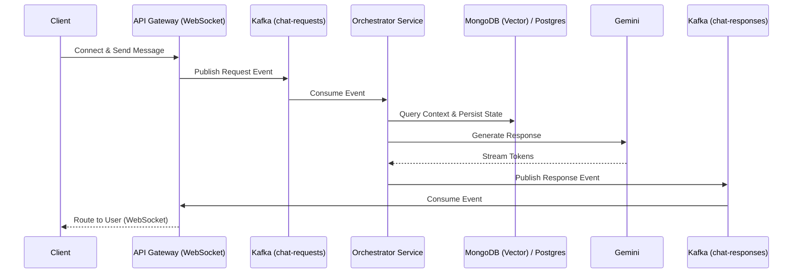

# CortexGate

CortexGate is a Spring Boot orchestration service designed to manage intelligent RAG (Retrieval-Augmented Generation) workflows. It utilizes Spring AI to interface with Large Language Models (LLMs) and Vector Databases.

## System Architecture

The repository implements a fully decoupled, event-driven architecture using Kafka, enabling scalable processing of long-running LLM generation requests over WebSockets.



## Features

- **Spring AI Integration**: Uses Gemini 2.5 Flash for chat generation and text-embedding-004 for vector embeddings.
- **MongoDB Atlas Local**: Stores and queries high-dimensional vector data directly using MongoDB's vector search capabilities.
- **Kafka Event Streaming**: Connects to an event bus for processing asynchronous orchestration requests.
- **PostgreSQL**: Stores relational metadata and long-term state.

## Known Limitations & Tradeoffs
- **Resilience**: The current implementation does not include advanced Kafka error handling (e.g., retries or Dead Letter Queues) for failed LLM generations.
- **Consistency**: There is no distributed transaction or strict consistency mechanism guaranteeing synchronous updates between MongoDB vector writes and PostgreSQL transactional writes.
- **Scalability**: While the architecture supports horizontal scaling for the Orchestrator, scaling the WebSocket API Gateway would require a sticky session or a pub/sub backplane (like Redis) which is not currently implemented.

## Prerequisites

- Docker and Docker Compose
- Java 21
- Maven 3.8+

## Running the Infrastructure

To run the backing infrastructure (MongoDB, PostgreSQL, Kafka, and Zookeeper), copy `.env.example` to `.env` and set your passwords, then use Docker Compose:

```bash
docker-compose up -d
```

### Services Started:
- **MongoDB Atlas Local**: `localhost:27017`
- **PostgreSQL**: `localhost:5434`
- **Kafka Broker**: `localhost:9092`
- **Zookeeper**: `localhost:2181`

## Configuration

Make sure your `application.yml` has the correct `api-key` and `base-url` for the Gemini OpenAI-compatible models. You should inject this securely via your environment variables as documented in `.env.example`.

```yaml
spring:
  ai:
    openai:
      api-key: ${GEMINI_API_KEY}
      base-url: https://generativelanguage.googleapis.com/v1beta/openai/
```

## Building and Running the Services

### 1. API Gateway
The API Gateway handles WebSocket connections and routes events to/from Kafka.
```bash
cd api-gateway
mvn spring-boot:run
```
*(Runs on port 8080)*

### 2. Orchestrator Service
The Orchestrator consumes requests, queries the DBs, interacts with Gemini, and publishes results.
```bash
cd orchestrator-service
mvn spring-boot:run
```
*(Runs on port 8081)*

## Load Testing

A `k6` load test script is provided in the `scripts/` directory to simulate concurrent WebSocket interactions.

```bash
k6 run scripts/load-test.js
```

**Example Observed Metrics (Local Environment):**
```
vus..................: 50      min=50           max=50
http_req_duration....: avg=185ms min=120ms med=160ms max=450ms p(90)=250ms p(95)=300ms
http_reqs............: 1000    15.5/s
```
